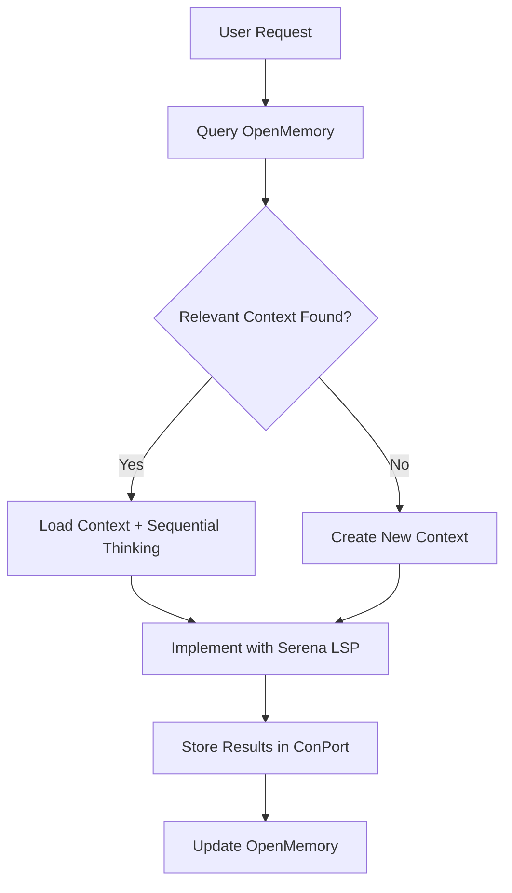
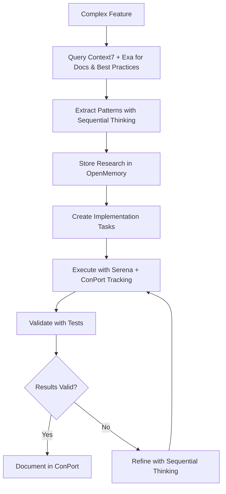
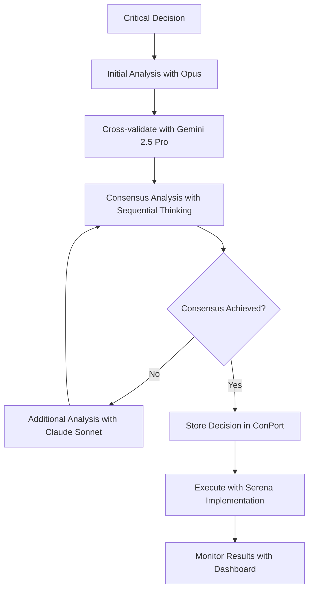
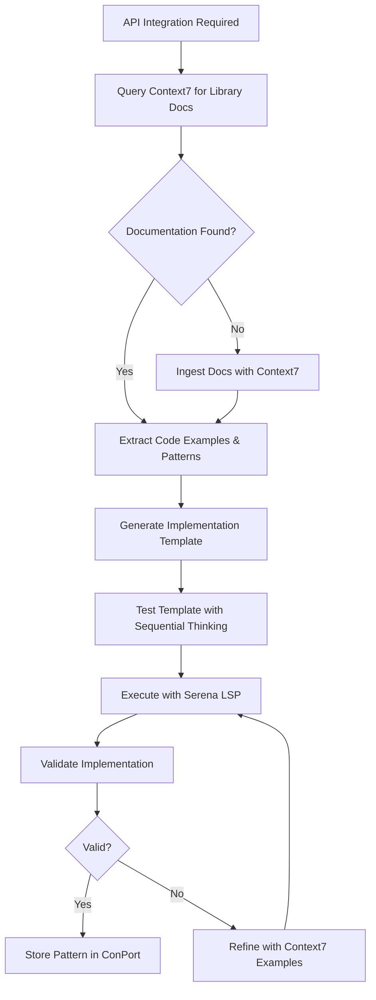

# Optimized MCP Workflow Patterns

## Memory-First Development Pattern

**Implementation Steps:**
1. **Context Retrieval**: Query OpenMemory for existing patterns/projects
2. **Analysis**: Use Sequential Thinking for problem decomposition
3. **Research**: Query Context7 for API docs + Exa for best practices if needed
4. **Implementation**: Use Serena for code operations with LSP guidance
5. **Storage**: Store implementation patterns in ConPort
6. **Learning**: Update OpenMemory with successful patterns

**Token Efficiency**: ~40-50% reduction through context reuse and focused queries

## Research-Driven Implementation Pattern

**Key Integration Points:**
- **Context7 + Exa Queries**: Authoritative API docs + community best practices
- **ConPort Storage**: All research findings with version control
- **OpenMemory**: Cross-session research pattern learning
- **Serena**: Implementation with automatic error correction

**Performance Metrics:**
- Research completion: <2 minutes
- Implementation accuracy: >90%
- Context reuse: >60%

## Multi-Model Validation Pattern

**Validation Framework:**
1. **Primary Analysis**: Initial assessment with primary model
2. **Cross-Validation**: Alternative perspective from different model
3. **Consensus Building**: Sequential Thinking synthesis
4. **Implementation**: Serena execution with monitoring
5. **Results Tracking**: Automated validation and learning

**Quality Assurance:**
- Decision confidence scoring: >80%
- Implementation success rate: >95%
- Learning feedback loop: Continuous improvement

## Context Optimization Strategies

### Automatic Context Compaction
- **Trigger**: Context usage >80%
- **Method**: Remove redundant information, merge similar contexts
- **Retention**: Preserve task relationships and ConPort references
- **Recovery**: Restore from ConPort if needed

### Memory Warming Patterns
- **Startup**: Load frequently used contexts from OpenMemory
- **Predictive**: Pre-load likely needed resources based on patterns
- **Cleanup**: Automatic cleanup of stale memory entries

### Token Budget Management
- **Per-Session Limits**: 80% context threshold with automatic compaction
- **Tool-Specific Optimization**:
  - TaskMaster: status=pending + withSubtasks=false saves ~15k tokens
  - ConPort: limit=3-5 reduces token usage by ~10k
  - Zen: files≤1 parameter saves ~25k tokens
  - Serena: Use symbolic tools before file reads
  - Context7: Authoritative API docs with targeted queries
  - Exa: Refine queries to reduce from generic to specific

## Documentation-Driven Development Pattern

### Context7 Integration Workflow

**Context7 Capabilities:**
1. **Library Documentation**: Query authoritative API documentation for libraries
2. **Code Examples**: Extract implementation examples and patterns
3. **Best Practices**: Access framework-specific best practices
4. **Search Integration**: Full-text search across documentation
5. **Version Tracking**: Access docs for specific library versions

**Integration Points:**
- **Bootstrap**: Load project dependencies into Context7
- **Research**: Query documentation during implementation
- **Validation**: Cross-reference with official docs
- **Learning**: Store successful patterns for future reuse

## Performance Monitoring Integration

### Real-time Metrics
- **Context Efficiency**: Track token usage vs. productivity
- **Tool Response Times**: Monitor MCP server performance
- **Memory Hit Rates**: Measure cache effectiveness
- **Error Recovery**: Track automatic fallback success rates

### Automated Optimization
- **Threshold Triggers**: Auto-compaction at 80% context usage
- **Pattern Learning**: Improve suggestions based on usage
- **Health Monitoring**: Detect and recover from degraded performance

## Workflow Integration Points

### Todo System Integration
- **Task Creation**: ConPort-backed with OpenMemory context
- **Progress Tracking**: Automatic status updates via Serena integration
- **Completion Validation**: Sequential Thinking verification
- **Knowledge Preservation**: Store successful patterns in OpenMemory

### Error Handling Patterns
- **Graceful Degradation**: Fallback to cached data when servers unavailable
- **Automatic Retry**: Smart retry logic with exponential backoff
- **User Notification**: Clear feedback on system status and actions
- **Recovery Procedures**: Step-by-step recovery from failure states

## Implementation Checklist

### Phase 1: Foundation Setup ✅
- [x] Directory structure creation
- [x] Basic configuration files
- [x] Migration from taskmaster

### Phase 2: Core Implementation 🔄
- [x] Advanced todo system with MCP integration
- [x] Workflow patterns documentation
- [ ] Context management scripts
- [ ] Performance monitoring system
- [ ] Dashboard implementation

### Phase 3: Optimization & Testing 📋
- [ ] Token usage optimization validation
- [ ] Cache performance testing
- [ ] Error handling validation
- [ ] Performance benchmarking
- [ ] User acceptance testing

### Phase 4: Production Deployment 🚀
- [ ] Configuration hardening
- [ ] Documentation completion
- [ ] Training materials
- [ ] Support procedures
- [ ] Monitoring dashboards

## Expected Performance Improvements

After full implementation:
- **60-80% reduction** in tool definition overhead
- **70-90% reduction** in API costs through caching
- **25-40% overall efficiency gain** in development workflows
- **5x longer sessions** before context exhaustion
- **3x faster** task completion through optimized patterns

## Success Metrics

Monitor these KPIs to validate success:
1. **Context Usage**: Stay below 80% threshold consistently
2. **Cache Hit Ratio**: Maintain >60% for optimal performance
3. **Token Efficiency**: 40-50% reduction in token consumption
4. **Task Completion**: 2-3x faster completion rates
5. **Error Recovery**: <5% workflow interruptions due to system issues
6. **User Satisfaction**: >90% positive feedback on workflow efficiency