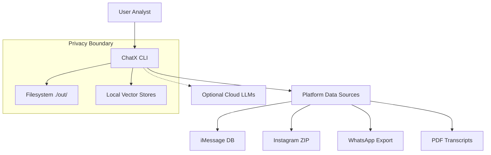

# ChatX/ChatRipper - Comprehensive Architecture Documentation
*Status: Master | Owner: Team | Last Updated: 2025-09-06*
*Document Version: 2.0 - Enhanced for Human and LLM Consumption*

## Overview & Core Philosophy

ChatX/ChatRipper is a **privacy-first, local-first forensic chat analysis platform** designed for investigators, researchers, and analysts who need to process large volumes of multi-platform chat data while maintaining strict privacy controls and evidence integrity.

### Core Design Principles

1. **Privacy by Default**: All processing occurs locally unless explicitly escalated to cloud services under strict Policy Shield controls
2. **Deterministic Outputs**: Schema-locked data structures ensure reproducible results and full provenance tracking
3. **Modular Architecture**: Clear separation of concerns with well-defined interfaces between components
4. **Extensibility First**: Designed for easy integration of new platforms, models, and storage backends
5. **Evidence Integrity**: Maintains chain of custody through cryptographic hashing and audit trails

---

## System Architecture (C4 Level 1-3)

### External Systems & Integration Points



**Key Integration Constraints**:
- Cloud LLMs receive only **redacted text** and **coarse labels**
- Attachments **never leave local storage** under any circumstances
- All external integrations implement Policy Shield preflight validation

### Core Processing Pipeline

The system follows a sequential, file-based processing pipeline:

```
Extract → Transform → Redact → Index → Enrich → Query
```

**Data Flow Characteristics**:
- **File-based Interchange**: Each stage consumes and produces JSON/JSONL files
- **Schema Enforcement**: All data validates against canonical schemas before processing
- **Provenance Tracking**: Each output includes metadata about processing steps and parameters
- **Error Isolation**: Failed processing steps quarantine invalid data without stopping entire pipeline

---

## Component Architecture Deep Dive

### 1. Ingestor System (`src/chatx/extractors/`, `src/chatx/imessage/`, `src/chatx/instagram/`)

**Purpose**: Platform-specific data extraction into canonical Message format

**Key Implementation Details**:
- **BaseExtractor Interface**: Standardized contract for all platform adapters
- **Schema Validation**: Immediate validation against `CanonicalMessage` schema
- **Attachment Handling**: Local-only policy with metadata extraction only
- **Error Resilience**: Continues processing despite individual message extraction failures

**Platform Support Matrix**:
| Platform | Module | Status | Key Features |
|----------|---------|---------|-------------|
| iMessage | `imessage/extract.py` | Production | DB parsing, backup support, attachment metadata |
| Instagram | `instagram/extract.py` | Production | ZIP parsing, user filtering, media reference |
| WhatsApp | TODO | Planned | Export file parsing, media handling |
| Plain Text | TODO | Planned | Simple conversation format parsing |
| PDF | `pdf_ingest/reader.py` | Development | Text layer + OCR fallback, speaker identification |

### 2. Transformer System (`src/chatx/transformers/`)

**Purpose**: Normalize and chunk conversations into analysis-ready windows

**Chunking Strategies**:
- **Turns-based**: 40 messages per chunk with 10-message stride (default)
- **Daily Windows**: Group messages by calendar day for sparse conversations
- **Fixed-length**: Character-based chunking for LLM context window optimization

**Key Components**:
- `chunker.py`: Implements chunking algorithms with configurable parameters
- `pipeline.py`: Orchestrates transformation with validation and error handling
- **Output**: Standardized chunk format with temporal metadata and message references

### 3. Policy Shield & Redaction System (`src/chatx/redaction/`)

**Purpose**: Privacy enforcement through pseudonymization and redaction

**Core Capabilities**:
- **≥99.5% Coverage**: Minimum redaction threshold (99.9% in strict mode)
- **Consistent Tokenization**: `TKN:…` format with salt-based consistency across runs
- **Hard-fail Detection**: Blocks processing for certain content classes (e.g., CSAM)
- **Preflight Validation**: Cloud readiness checks before any external data transmission

**Implementation Architecture**:
```python
class PolicyShield:
    def __init__(self, policy: PrivacyPolicy, salt_file: Path = None):
        # Privacy policy configuration
        # Salt management for consistent tokenization
        # Pattern matching engines
        
    def redact_chunks(self, chunks: List[Dict]) -> Tuple[List[Dict], RedactionReport]:
        # Main redaction logic
        # Coverage calculation
        # Report generation
```

### 4. Differential Privacy Engine (`src/chatx/privacy/`)

**Purpose**: Provide (ε,δ)-differential privacy for statistical aggregation

**Key Features**:
- **Default Parameters**: ε=1.0, δ=1e-6 with calibrated Laplace noise
- **Query Types**: Count, sum, mean, histogram with proper sensitivity analysis
- **Budget Management**: Privacy budget composition and tracking across queries
- **Integration**: Seamless integration with PolicyShield redaction pipeline

**Privacy-Preserving Statistics**:
- Safe statistical summaries for cloud processing
- Protection of individual privacy while enabling aggregate analysis
- Mathematical guarantees of privacy protection

### 5. Indexing System (`src/chatx/indexing/`)

**Purpose**: Create searchable vector embeddings for fast retrieval

**Storage Backends**:
- **ChromaDB** (default): Local vector store with per-contact collections
- **Multi-vector**: Psychology-aware indexing across multiple semantic spaces
- **Extensible**: `BaseVectorStore` interface for additional backends (pgvector, Weaviate)

**Multi-vector Architecture**:
```python
class MultiVectorConfig:
    # Configuration for psychology-aware indexing
    # Vector space weighting
    # Collection management

class MultiVectorChromaDBStore:
    def index_chunks(self, chunks: List[Dict], contact: str) -> Dict:
        # Index across multiple semantic spaces
        # Psychological vector generation
        # Temporal pattern indexing
```

### 6. Enrichment System (`src/chatx/enrichment/`)

**Purpose**: Add LLM-generated metadata and psychological analysis

**Enrichment Strategies**:
- **Local-only**: On-device LLM (Ollama) with deterministic outputs
- **Hybrid**: Confidence-gated escalation to cloud LLMs (τ=0.7 threshold)
- **Multi-pass**: Comprehensive 4-stage psychological analysis

**Key Components**:
- `enricher.py`: Main enrichment orchestration with confidence gating
- `ollama_client.py`: Local LLM integration with performance monitoring
- `multi_pass_pipeline.py`: Sophisticated psychological analysis pipeline

**Four-Pass Enrichment Process**:
1. **Entity Extraction**: Pattern matching and basic entity recognition
2. **Communication Structure**: Speech acts and conversation dynamics
3. **Psychological Analysis**: 150+ label taxonomy application
4. **Relationship Dynamics**: Temporal patterns and interaction analysis

### 7. Validation System (`src/chatx/schemas/`, `src/chatx/validate/`)

**Purpose**: Ensure data integrity and schema compliance throughout pipeline

**Validation Layers**:
- **Schema Validation**: JSON Schema enforcement at all pipeline stages
- **Business Logic**: Domain-specific validation rules
- **Privacy Compliance**: Policy Shield requirement verification

**Error Handling**:
- **RFC-7807 Compliance**: Structured error responses in problem+json format
- **Quarantine System**: Invalid data isolation with detailed error reporting
- **Non-blocking**: Validation failures don't stop entire pipeline processing

### 8. Observability System (`src/chatx/obs/`, `src/chatx/utils/`)

**Purpose**: Monitoring, metrics, and artifact generation

**Key Components**:
- **Structured Logging**: JSON-formatted logs with rich context
- **Performance Metrics**: Processing throughput, latency, resource usage
- **Artifact Generation**: Redaction reports, validation summaries, run statistics
- **Provenance Tracking**: Complete audit trail of all processing steps

---

## Data Architecture

### Canonical Data Structures

**Message Schema (`schemas/message.py`)**:
```python
class CanonicalMessage(BaseModel):
    id: str  # Unique message identifier
    text: str  # Message content
    timestamp: datetime  # Original message timestamp
    sender: str  # Sender identifier
    platform: str  # Source platform
    attachments: List[Attachment]  # Media metadata
    # ... additional fields
```

**Chunk Schema**:
```python
class ConversationChunk(BaseModel):
    text: str  # Combined chunk text
    meta: ChunkMetadata  # Temporal bounds, message references
    enrichment: Optional[EnrichmentData]  # LLM-generated metadata
```

### Storage Layout (`./out/` directory structure)

```
./out/
├── raw/           # Original platform exports (read-only)
├── messages/      # Canonical Message JSON (validated)
├── chunks/        # Normalized conversation chunks  
├── redacted/      # Pseudonymized, safe data
├── enriched/      # LLM-generated metadata
├── indexed/       # Vector embeddings & search indices
├── reports/       # Validation, redaction, performance reports
├── cache/         # Prompt/output cache for efficiency
└── quarantine/    # Invalid data isolation with error details
```

**Data Provenance**: Each file includes metadata about:
- Processing timestamp and parameters
- Source data and transformation steps
- Validation status and any warnings
- Privacy compliance information

---

## Privacy & Security Architecture

### Policy Shield Implementation

**Coverage Enforcement**:
- **Minimum 99.5%** redaction coverage required
- **Strict mode** enforces 99.9% coverage threshold
- **Real-time monitoring** during processing
- **Preflight validation** before any external data transmission

**Tokenization System**:
- **Consistent pseudonymization** across processing runs
- **Salt-based hashing** for deterministic token generation
- **Type-specific tokens** (`TKN:EMAIL:abc123`, `TKN:PHONE:def456`)
- **Reversible mapping** stored locally only when required

### Differential Privacy Integration

**Statistical Protection**:
- **(ε,δ)-differential privacy** for all aggregate statistics
- **Laplace mechanism** with calibrated noise injection
- **Privacy budget management** across multiple queries
- **Sensitivity analysis** for each statistical operation

**Cloud-safe Data Preparation**:
- **Coarse labels only** for cloud transmission
- **Fine-grained analysis** remains local-only
- **Statistical summaries** protect individual privacy
- **Policy compliance verification** before any external data transfer

---

## Performance & Scalability

### Performance Targets

| Operation | Target | Measurement |
|-----------|---------|-------------|
| Extraction | ≥5k messages/min/contact | Dev laptop with SSD |
| Local Enrichment | ≥1k messages/min | Ollama with Gemma-2-9B |
| Hybrid Enrichment | ≥500 messages/min | Local + cloud with τ=0.7 gating |
| Query Response | <5s over 100k messages | ChromaDB with optimized indices |
| Memory Usage | <4GB for 1M messages | Efficient chunk processing |

### Scaling Considerations

**Vertical Scaling**:
- GPU acceleration for local LLM inference
- Increased memory for larger working sets
- SSD storage for faster I/O operations

**Horizontal Scaling**:
- Per-contact processing isolation
- Sharded vector stores for large corpora
- Distributed processing for massive datasets

**Optimization Strategies**:
- Batch processing for efficient resource utilization
- Caching of frequent operations and LLM responses
- Progressive loading for memory-constrained environments

---

## Extensibility Architecture

### Platform Extension Pattern

**Implementing New Extractors**:
```python
class NewPlatformExtractor(BaseExtractor):
    def extract_messages(self, source: Path, **kwargs) -> List[CanonicalMessage]:
        # Platform-specific parsing logic
        # Conversion to canonical message format
        # Attachment metadata extraction
        
    def validate_source(self, source: Path) -> bool:
        # Source format validation
        # Required file structure checking
```

**Required Integration Points**:
- **Schema compliance** with CanonicalMessage format
- **Error handling** and validation reporting
- **Attachment policy** adherence (local-only metadata)
- **Provenance tracking** for audit purposes

### LLM Backend Extension

**BaseLLMClient Interface**:
```python
class BaseLLMClient(ABC):
    @abstractmethod
    async def generate_enrichment(self, chunk: Dict, context: Dict) -> EnrichmentResult:
        # LLM inference implementation
        # Confidence scoring
        # Error handling and retries
```

**Supported Backends**:
- **Ollama** (local) - Primary implementation
- **OpenAI API** (cloud) - Policy Shield integrated
- **Anthropic Claude** (cloud) - Policy Shield integrated
- **Custom endpoints** - HTTP-based integration

### Storage Backend Extension

**BaseVectorStore Interface**:
```python
class BaseVectorStore(ABC):
    @abstractmethod
    def index_chunks(self, chunks: List[Dict], contact: str) -> Dict:
        # Vector embedding generation
        # Index storage implementation
        # Collection management
        
    @abstractmethod  
    def search(self, query: str, contact: str, k: int = 10) -> List[SearchResult]:
        # Query processing
        # Similarity search
        # Result formatting
```

**Available Implementations**:
- **ChromaDB** - Default local vector store
- **MultiVectorChromaDB** - Psychology-aware indexing
- **pgvector** - PostgreSQL-based vector storage
- **Weaviate** - Graph-based vector database

---

## Error Handling & Resilience

### Structured Error Management

**RFC-7807 Compliance**:
```json
{
  "type": "https://chatx.dev/errors/invalid-input",
  "title": "Source path not found",
  "status": 1,
  "detail": "Path does not exist: /invalid/path",
  "instance": "/invalid/path"
}
```

**Error Classification**:
- **Validation Errors**: Schema violations, format issues
- **Runtime Errors**: Processing failures, resource constraints  
- **Policy Violations**: Privacy compliance failures
- **Integration Errors**: External service failures

### Fault Tolerance Strategies

**Processing Resilience**:
- **Non-blocking validation**: Invalid data quarantined, processing continues
- **Retry mechanisms**: Transient failures automatically retried
- **Graceful degradation**: Feature reduction instead of complete failure
- **Resource monitoring**: Memory, CPU, and storage usage tracking

**Data Integrity**:
- **Atomic writes**: File operations complete successfully or not at all
- **Checksum verification**: Data integrity validation at pipeline stages
- **Backup points**: Intermediate results preserved for restart capability
- **Audit trails**: Complete processing history for forensic analysis

---

## Deployment & Operations

### Local Development

**Quick Start**:
```bash
# Install dependencies
pip install -e .[dev]

# Run basic validation
ruff check .
mypy src
pytest --cov=src/chatx --cov-fail-under=90

# Process sample data
chatx imessage pull --contact "+15551234567" --out ./out
chatx transform ./out/messages_*.json --contact "+15551234567"
chatx redact ./out/chunks_*.jsonl --threshold 0.995
```

### Production Considerations

**Resource Requirements**:
- **CPU**: Multi-core for parallel processing
- **Memory**: 4GB+ for large message corpora
- **Storage**: Fast SSD for I/O-intensive operations
- **GPU**: Optional for accelerated local LLM inference

**Monitoring & Alerting**:
- **Structured logging** for operational monitoring
- **Performance metrics** for capacity planning
- **Error rate tracking** for reliability assessment
- **Privacy compliance** monitoring for policy adherence

**Backup & Recovery**:
- **Intermediate data preservation** for restart capability
- **Configuration versioning** for reproducible processing
- **Audit trail maintenance** for forensic requirements
- **Disaster recovery** planning for critical deployments

---

## Future Evolution

### Near-term Roadmap

**Q4 2025**:
- WhatsApp export support implementation
- Enhanced PDF ingestion with improved OCR
- Additional vector store backends (pgvector, Weaviate)
- Advanced psychological analysis models

**Q1 2026**:
- Real-time processing capabilities
- Enhanced visualization and reporting
- Additional platform integrations (Signal, Telegram)
- Cloud-native deployment options

### Architectural Evolution

**Planned Enhancements**:
- **Streaming processing** for continuous data ingestion
- **Distributed architecture** for horizontal scaling
- **Enhanced caching** for performance optimization
- **Advanced analytics** for pattern detection and trend analysis

**Technology Adoption**:
- **Rust components** for performance-critical operations
- **WebAssembly** for browser-based processing
- **Advanced vector databases** for improved retrieval
- **Federated learning** for privacy-preserving model improvement

---

## References & Related Documents

- [Acceptance Criteria](acceptance-criteria.md) - User stories and test scenarios
- [Interface Specifications](interfaces.md) - CLI contracts and API definitions
- [Component Specifications](design/specifications/) - Detailed implementation guides
- [Architecture Decision Records](design/adrs/) - Design rationale and trade-offs
- [Test Strategy](development/test-strategy.md) - Quality assurance approach
- [Deployment Guide](operations/deployment.md) - Installation and configuration
- [Security Policy](security/policy.md) - Privacy and security requirements

---

*This document represents the authoritative architecture reference for ChatX/ChatRipper. All significant architectural changes should be documented through Architecture Decision Records (ADRs) and reflected in this document.*