# ChatX/ChatRipper - LLM Integration Guide
*Status: Active | Owner: AI/ML Team | Last Updated: 2025-09-06*

## Purpose
This document provides comprehensive guidance for integrating and working with Large Language Models (LLMs) within the ChatX/ChatRipper platform. It covers model selection, integration patterns, performance optimization, and best practices for LLM-powered features.

---

## Supported LLM Backends

### Local Models (Primary)

**Ollama Integration** (`src/chatx/enrichment/ollama_client.py`):
```python
# Default local model configuration
DEFAULT_MODEL = "gemma2:9b-instruct-q4_K_M"

# Supported local models with characteristics
LOCAL_MODELS = {
    "gemma2:9b-instruct-q4_K_M": {
        "size": "9B parameters",
        "context": "8K tokens", 
        "speed": "Fast",
        "quality": "High",
        "use_case": "General enrichment"
    },
    "llama3.1:8b-instruct-q4_K_M": {
        "size": "8B parameters",
        "context": "8K tokens",
        "speed": "Very Fast", 
        "quality": "Good",
        "use_case": "Rapid processing"
    },
    "qwen2.5:14b-instruct-q4_K_M": {
        "size": "14B parameters", 
        "context": "32K tokens",
        "speed": "Medium",
        "quality": "Excellent",
        "use_case": "Complex analysis"
    }
}
```

### Cloud Models (Policy Shield Gated)

**Supported Cloud Providers**:
- OpenAI GPT-4o/GPT-4
- Anthropic Claude 3.5 Sonnet/Opus  
- Google Gemini 2.0
- Azure OpenAI

**Integration Requirements**:
- Must pass Policy Shield preflight validation
- Only redacted data and coarse labels allowed
- Strict token and context window limits
- Mandatory confidence threshold gating (τ=0.7)

---

## LLM Integration Architecture

### Core Components

```mermaid
graph TB
    A[Redacted Chunks] --> B[Confidence Gate]
    B --> C{τ ≥ 0.7?}
    C -->|Yes| D[Cloud LLM]
    C -->|No| E[Local LLM]
    D --> F[Cloud Enrichment]
    E --> G[Local Enrichment]
    F --> H[Schema Validation]
    G --> H
    H --> I[Enriched Output]
    
    subgraph "Policy Shield Boundary"
        B
        C
        D
    end
```



### Enrichment Pipeline (`src/chatx/enrichment/enricher.py`)

**Standard Enrichment Flow**:
```python
async def enrich_chunks(self, chunks: List[Dict], contact: str) -> List[Dict]:
    """Main enrichment orchestration."""
    
    enriched_chunks = []
    
    for chunk in chunks:
        # Confidence gating decision
        use_cloud = self._should_use_cloud(chunk)
        
        if use_cloud and self.allow_cloud:
            # Cloud enrichment with strict controls
            enrichment = await self._cloud_enrich(chunk, contact)
        else:
            # Local enrichment (default)
            enrichment = await self._local_enrich(chunk, contact)
        
        # Schema validation and output preparation
        validated = self._validate_enrichment(enrichment)
        enriched_chunks.append({**chunk, "enrichment": validated})
    
    return enriched_chunks
```

### Multi-pass Enrichment (`src/chatx/enrichment/multi_pass_pipeline.py`)

**Four-Stage Analysis**:
```python
class MultiPassEnrichmentPipeline:
    async def enrich_chunks_batch(self, chunks: List[Dict], contact: str) -> List[Dict]:
        """Comprehensive 4-pass psychological analysis."""
        
        results = []
        
        for chunk in chunks:
            # Pass 1: Entity Extraction
            entities = await self._pass_entity_extraction(chunk)
            
            # Pass 2: Communication Structure  
            structure = await self._pass_communication_analysis(chunk, entities)
            
            # Pass 3: Psychological Analysis
            psychology = await self._pass_psychological_analysis(chunk, structure)
            
            # Pass 4: Relationship Dynamics
            relationships = await self._pass_relationship_analysis(chunk, psychology)
            
            # Combine results
            enriched = self._combine_results(entities, structure, psychology, relationships)
            results.append(enriched)
        
        return results
```

---

## Model Configuration & Management

### Configuration Structure (`src/chatx/enrichment/models.py`)

**Ollama Model Configuration**:
```python
class OllamaModelConfig(BaseModel):
    """Configuration for Ollama local models."""
    
    name: str = "gemma2:9b-instruct-q4_K_M"
    temperature: float = 0.0  # Deterministic outputs
    seed: int = 42  # Fixed seed for reproducibility
    num_predict: int = 800  # Max tokens to generate
    top_k: int = 40
    top_p: float = 0.9
    repeat_penalty: float = 1.1
    
    # Performance tuning
    batch_size: int = 4  # Concurrent requests
    timeout: int = 30  # Seconds per request
    max_retries: int = 3
```

**Cloud Model Configuration**:
```python
class CloudModelConfig(BaseModel):
    """Configuration for cloud LLM providers."""
    
    provider: str = "openai"  # openai|anthropic|google|azure
    model: str = "gpt-4o"
    
    # Strict limits for privacy and cost control
    max_tokens: int = 1000
    max_context: int = 4000  # Reduced context for safety
    temperature: float = 0.1  # Low creativity for deterministic outputs
    
    # Policy enforcement
    allowed_categories: List[str] = Field(
        default_factory=lambda: ["coarse_labels", "general_analysis"]
    )
    blocked_categories: List[str] = Field(
        default_factory=lambda: ["fine_grained", "personal_analysis"]
    )
```

### Confidence Gating System

**Threshold Configuration**:
```python
class ConfidenceGateConfig(BaseModel):
    """Configuration for confidence-based routing."""
    
    # Primary confidence threshold
    tau: float = 0.7  # ≥0.7 uses cloud, <0.7 uses local
    
    # Hysteresis for stability
    tau_low: float = 0.62  # Must drop below to switch from cloud to local
    tau_high: float = 0.78  # Must rise above to switch from local to cloud
    
    # Minimum samples for decision
    min_samples: int = 5
    
    # Confidence calculation method
    method: str = "weighted_average"  # weighted_average|min|max
```

**Gating Logic**:
```python
def _should_use_cloud(self, chunk: Dict) -> bool:
    """Determine if chunk should use cloud processing."""
    
    # Check policy shield compliance first
    if not self.policy_shield.validate_cloud_readiness(chunk):
        return False
    
    # Calculate confidence score
    confidence = self._calculate_confidence(chunk)
    
    # Apply hysteresis
    if self.last_decision_was_cloud:
        return confidence >= self.config.tau_low
    else:
        return confidence >= self.config.tau_high
```

---

## Prompt Engineering Guidelines

### Standard Prompt Structure

**Base Template**:
```python
BASE_PROMPT_TEMPLATE = """
You are a forensic chat analysis assistant. Analyze the following conversation chunk 
and provide structured enrichment data.

## Conversation Chunk:
{chunk_text}

## Analysis Instructions:
1. Extract key entities and patterns
2. Analyze communication structure and speech acts  
3. Provide psychological insights using the provided taxonomy
4. Identify relationship dynamics and temporal patterns

## Output Format:
{output_format}

## Constraints:
- Use only the provided taxonomy labels
- Maintain strict JSON output format
- Do not make assumptions beyond the provided text
- Focus on observable patterns, not speculation
"""
```

### Taxonomy-Based Prompting

**Label Taxonomy Integration**:
```python
def _build_taxonomy_prompt(self, taxonomy: Dict) -> str:
    """Build prompt section for label taxonomy."""
    
    prompt_sections = []
    
    for category, labels in taxonomy.items():
        prompt_sections.append(f"## {category.upper()}:")
        for label in labels:
            prompt_sections.append(f"- {label}")
        prompt_sections.append("")
    
    return "\n".join(prompt_sections)
```

**Dynamic Prompt Assembly**:
```python
def assemble_prompt(self, chunk: Dict, taxonomy: Dict) -> str:
    """Assemble complete prompt with dynamic components."""
    
    return BASE_PROMPT_TEMPLATE.format(
        chunk_text=chunk["text"],
        output_format=json.dumps(OUTPUT_SCHEMA, indent=2),
        taxonomy_section=self._build_taxonomy_prompt(taxonomy),
        constraints=self._build_constraints_section(chunk)
    )
```

### Privacy-Safe Prompting

**Redaction-Aware Prompts**:
```python
def create_privacy_safe_prompt(self, redacted_chunk: Dict) -> str:
    """Create prompt that respects privacy constraints."""
    
    # Use only redacted text
    safe_text = redacted_chunk["text"]
    
    # Include only allowed metadata
    safe_metadata = {
        k: v for k, v in redacted_chunk["meta"].items() 
        if k in ALLOWED_CLOUD_METADATA
    }
    
    return f"""
Analyze this privacy-redacted conversation chunk:

{safe_text}

Available metadata: {json.dumps(safe_metadata, indent=2)}

Provide analysis using only coarse-grained labels.
"""
```

---

## Performance Optimization

### Batch Processing

**Efficient Batch Enrichment**:
```python
async def enrich_batch(self, chunks: List[Dict], batch_size: int = 4) -> List[Dict]:
    """Process chunks in batches for efficiency."""
    
    results = []
    
    for i in range(0, len(chunks), batch_size):
        batch = chunks[i:i + batch_size]
        
        # Process batch concurrently
        batch_tasks = [
            self._enrich_single(chunk) 
            for chunk in batch
        ]
        
        batch_results = await asyncio.gather(*batch_tasks)
        results.extend(batch_results)
        
        # Respect rate limits
        await asyncio.sleep(0.1)
    
    return results
```

### Caching Strategies

**Response Caching**:
```python
class EnrichmentCache:
    """Cache LLM responses to avoid redundant processing."""
    
    def __init__(self, max_size: int = 10000):
        self.cache = LRUCache(max_size=max_size)
        self.hits = 0
        self.misses = 0
    
    async def get_enrichment(self, chunk: Dict) -> Optional[Dict]:
        """Get cached enrichment or None if not found."""
        
        cache_key = self._generate_cache_key(chunk)
        
        if cache_key in self.cache:
            self.hits += 1
            return self.cache[cache_key]
        
        self.misses += 1
        return None
    
    def _generate_cache_key(self, chunk: Dict) -> str:
        """Generate cache key based on chunk content and model config."""
        
        # Use text hash and configuration fingerprint
        text_hash = hashlib.sha256(chunk["text"].encode()).hexdigest()
        config_hash = self._config_fingerprint()
        
        return f"{text_hash}:{config_hash}"
```

### Performance Monitoring

**Metrics Collection**:
```python
class EnrichmentMetrics:
    """Collect and report enrichment performance metrics."""
    
    def __init__(self):
        self.latencies = []
        self.successes = 0
        self.failures = 0
        self.token_usage = {"input": 0, "output": 0}
    
    def record_success(self, latency: float, tokens: Dict):
        """Record successful enrichment."""
        self.latencies.append(latency)
        self.successes += 1
        self.token_usage["input"] += tokens.get("input", 0)
        self.token_usage["output"] += tokens.get("output", 0)
    
    def get_performance_report(self) -> Dict:
        """Generate performance summary."""
        
        if not self.latencies:
            return {"error": "No data collected"}
        
        return {
            "total_requests": self.successes + self.failures,
            "success_rate": self.successes / (self.successes + self.failures),
            "average_latency_ms": sum(self.latencies) / len(self.latencies),
            "p95_latency_ms": sorted(self.latencies)[int(len(self.latencies) * 0.95)],
            "token_usage": self.token_usage,
            "throughput": self.successes / (sum(self.latencies) / 1000) if self.latencies else 0
        }
```

---

## Error Handling & Resilience

### Retry Logic

**Smart Retry Mechanism**:
```python
async def _enrich_with_retries(self, prompt: str, max_retries: int = 3) -> Dict:
    """Execute enrichment with automatic retries."""
    
    last_error = None
    
    for attempt in range(max_retries):
        try:
            start_time = time.time()
            result = await self.llm_client.generate(prompt)
            latency = (time.time() - start_time) * 1000
            
            self.metrics.record_success(latency, result["usage"])
            return result
            
        except (TimeoutError, ConnectionError) as e:
            last_error = e
            wait_time = 2 ** attempt  # Exponential backoff
            logger.warning(f"Attempt {attempt + 1} failed, retrying in {wait_time}s: {e}")
            await asyncio.sleep(wait_time)
            
        except ValidationError as e:
            # Schema validation failures are not retryable
            logger.error(f"Schema validation failed: {e}")
            raise
    
    # All retries exhausted
    logger.error(f"All {max_retries} attempts failed: {last_error}")
    self.metrics.record_failure()
    raise LLMError(f"Enrichment failed after {max_retries} attempts: {last_error}")
```

### Fallback Strategies

**Graceful Degradation**:
```python
async def _enrich_with_fallback(self, chunk: Dict) -> Dict:
    """Enrich with fallback to simpler analysis if primary fails."""
    
    try:
        # Try primary enrichment method
        return await self._primary_enrichment(chunk)
        
    except LLMError as e:
        logger.warning(f"Primary enrichment failed, falling back: {e}")
        
        try:
            # Fallback to simpler analysis
            return await self._fallback_enrichment(chunk)
            
        except Exception as fallback_error:
            logger.error(f"Fallback enrichment also failed: {fallback_error}")
            
            # Minimal enrichment to avoid complete failure
            return {
                "analysis_type": "minimal",
                "confidence": 0.1,
                "error": str(fallback_error),
                "fallback_used": True
            }
```

---

## Testing & Validation

### Unit Testing Patterns

**Mock LLM Responses**:
```python
@pytest.fixture
def mock_llm_client():
    """Mock LLM client for testing."""
    
    client = Mock(spec=BaseLLMClient)
    
    # Mock successful response
    client.generate.return_value = {
        "text": json.dumps(VALID_ENRICHMENT),
        "usage": {"input_tokens": 100, "output_tokens": 50}
    }
    
    return client

def test_enrichment_happy_path(mock_llm_client):
    """Test successful enrichment scenario."""
    
    enricher = MessageEnricher(ollama_client=mock_llm_client)
    result = await enricher.enrich_chunks([TEST_CHUNK])
    
    assert len(result) == 1
    assert result[0]["enrichment"]["analysis_type"] == "standard"
    mock_llm_client.generate.assert_called_once()
```

**Error Scenario Testing**:
```python
def test_enrichment_timeout_handling():
    """Test timeout error handling."""
    
    mock_client = Mock(spec=BaseLLMClient)
    mock_client.generate.side_effect = TimeoutError("Request timed out")
    
    enricher = MessageEnricher(ollama_client=mock_client)
    
    with pytest.raises(LLMError) as exc_info:
        await enricher.enrich_chunks([TEST_CHUNK])
    
    assert "timed out" in str(exc_info.value)
    assert mock_client.generate.call_count == 3  # Max retries
```

### Integration Testing

**End-to-End Testing**:
```python
@pytest.mark.integration
async def test_full_enrichment_pipeline():
    """Test complete enrichment pipeline with real Ollama."""
    
    # Skip if Ollama not available
    if not ollama_available():
        pytest.skip("Ollama not available")
    
    # Test with real Ollama instance
    client = ProductionOllamaClient()
    enricher = MessageEnricher(ollama_client=client)
    
    results = await enricher.enrich_chunks([TEST_CHUNK])
    
    assert len(results) == 1
    assert "enrichment" in results[0]
    assert results[0]["enrichment"]["confidence"] >= 0.0
```

---

## Deployment & Monitoring

### Health Checking

**LLM Health Monitoring**:
```python
async def check_llm_health(self) -> Dict:
    """Comprehensive LLM health check."""
    
    health = {"status": "unknown", "components": {}}
    
    try:
        # Check Ollama availability
        ollama_health = await self.ollama_client.health_check()
        health["components"]["ollama"] = ollama_health
        
        # Check model availability  
        model_status = await self.ollama_client.check_model(self.config.model)
        health["components"]["model"] = model_status
        
        # Performance check
        perf_test = await self._performance_test()
        health["components"]["performance"] = perf_test
        
        health["status"] = "healthy" if all(
            comp.get("healthy", False) 
            for comp in health["components"].values()
        ) else "degraded"
        
    except Exception as e:
        health["status"] = "unhealthy"
        health["error"] = str(e)
    
    return health
```

### Resource Management

**Dynamic Resource Allocation**:
```python
class ResourceManager:
    """Manage LLM resource allocation based on system conditions."""
    
    def __init__(self):
        self.concurrency_limit = 4  # Default
        self.memory_threshold = 0.8  # 80% memory usage
    
    async def adjust_resources(self):
        """Adjust resource allocation based on system metrics."""
        
        memory_usage = get_memory_usage()
        cpu_usage = get_cpu_usage()
        
        if memory_usage > self.memory_threshold or cpu_usage > 0.9:
            # Reduce concurrency under pressure
            new_limit = max(1, self.concurrency_limit - 1)
            logger.warning(f"Reducing concurrency from {self.concurrency_limit} to {new_limit}")
            self.concurrency_limit = new_limit
            
        elif memory_usage < 0.6 and cpu_usage < 0.7:
            # Increase concurrency when resources available
            new_limit = min(8, self.concurrency_limit + 1)
            logger.info(f"Increasing concurrency from {self.concurrency_limit} to {new_limit}")
            self.concurrency_limit = new_limit
```

---

## Best Practices Summary

### Do's
- ✅ Use deterministic temperature (0.0) for reproducible results
- ✅ Implement comprehensive error handling and retries
- ✅ Cache responses to avoid redundant processing  
- ✅ Monitor performance and resource usage continuously
- ✅ Validate all outputs against strict schemas
- ✅ Use confidence gating for cloud/local routing

### Don'ts
- ❌ Don't expose raw PII in prompts or logs
- ❌ Don't bypass Policy Shield validation
- ❌ Don't use high creativity settings for forensic analysis
- ❌ Don't process without proper error handling
- ❌ Don't ignore rate limits and resource constraints
- ❌ Don't skip output validation and schema compliance

### Performance Tips
- 🚀 Use batch processing for efficiency
- 🚀 Implement response caching
- 🚀 Monitor and adjust concurrency dynamically  
- 🚀 Use streaming for large outputs
- 🚀 Implement graceful degradation for reliability

---

## Version Compatibility

- **Ollama Version**: ≥0.1.30
- **Python**: 3.11+
- **Supported Models**: Gemma2, Llama3.1, Qwen2.5+
- **Last Updated**: 2025-09-06

*This document should be updated whenever new LLM integration patterns, models, or best practices are established for the ChatX/ChatRipper platform.*